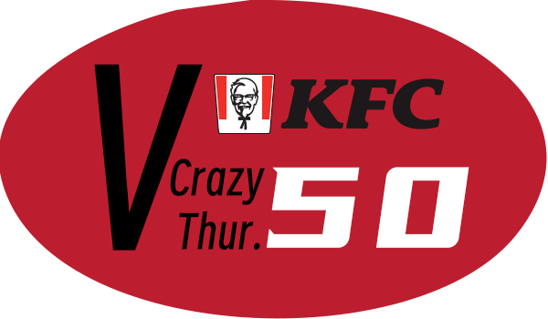

    
    

    <h1>V我50文案库</h1>

一个肯德基疯狂星期四文案库APP，基于[vme by zkl23333](https://github.com/zkl2333/vme)仓库提供的API实现

该项目是我用于学习 [Android jetpack compose](https://developer.android.google.cn/jetpack?hl=zh-cn) 而创建的。~~所以我将其当成一个学习的代码备忘录使用(~~

## 致谢

**API使用:** [vme by zkl23333](https://github.com/zkl2333/vme)

**灵感来源:** [KFC-Crazy-Thursday by whitescent](https://github.com/whitescent/KFC-Crazy-Thursday)

**在安卓开发上提供帮助:** [MoonLeeeaf - Github](https://github.com/MoonLeeeaf)

**在安卓开发上提供帮助:** [Gemini - Google](https://gemini.google.com)

## 起因

当我某一天打开Github想要查看大佬们又搞出什么新东西的时候，偶然间看到我的朋友Star了这个[项目](https://github.com/whitescent/KFC-Crazy-Thursday)

于是在后来我学习jetpack的时候正好学到调用API这里，就想到了这个项目

想说能不能使用这个API来练习，搓一个APP出来

于是就有了这个应用 ~~屎山~~

## 未来更新计划

- [x] 添加logo到主页面
- [x] 添加设置选项
- [ ] 实现主题 / 关于功能
- [x] 添加分享按钮